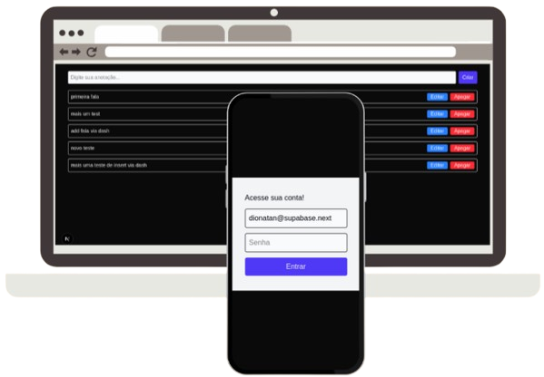

# TalkToText with Sign Up
 Um sistema simples e intuitivo para transformar seus pensamentos falados em lembretes escritos.

### Imagem do projeto

#### Acesso
[talk-to-text-dionatan.vercel.app](https://talk-to-text-dionatan.vercel.app/login)

#### Desenvolvedor
Dionatan Eduardo Correa Rodrigues - Ciência da Computação

#### Sobre o produto

Desenvolvi um sistema de gerenciamento de anotações, permitindo que usuários registrem, visualizem e gerenciem suas tarefas em um único lugar. Ofereço uma solução digital centralizada onde é possível criar lembretes, editar informações e remover tarefas concluídas, tudo com acesso seguro através de login pessoal.

#### Desenvolvimento

O processo de desenvolvimento exigiu a aprendizagem de novas tecnologias como o Supabase e sua integração com Next.js. Primeiro precisei pesquisar sobre autenticação, operações CRUD e Server Actions. Comecei configurando o Supabase no projeto, criando uma instância do banco de dados PostgreSQL e definindo as tabelas necessárias. Em seguida, implementei o sistema de autenticação, operações CRUD e criei Server Actions específicas para cada função: (createNote,deleteNote,updateNote)

//TODO:Descrever sobre o processo de desenvolvimento da área de cadastro do login e sobre a integração com IA.

#### Tecnologias

- **Next.js**: Framework front-end facilitando o uso de React.
- **Supabase**:  Backend como serviço(BaaS), oferece banco de dados PostgreSQL em tempo real, autenticação.
- **Tailwind**: Utilizado para uso de classes  estilisadas.
- **Git**: Utilizado no versionamento de todo projeto.

#### Ambiente de desenvolvimento

- **VS Code + extenções**: IDE utilizada no desenvolvimento com auxílio de algumas extensões.
- **(extensão)Prettier Code formatter**: Formatador de código fornecendo um padrão estabelecido.
- **(extensão)Gitmoji**: Auxilia na padronização de commits.
- **(extensão)Auto Rename tag**: Renomeia a tag de fechamento HTML simultaneamente a escrita da tag de abertura.
- **(extensão)Markdown Preview Github Styling**: Cria uma segunda aba dentro do VSCODE para a vizualização do README durante a criação facilitando o desenvolvimento do mesmo.

#### Link para os commits do projeto
[commits-link](https://github.com/Dionatan2019Rodrigues/TalkToText/commits/main/)

#### Referências e créditos

- [Canva](https://www.canva.com/) para construção do mockup deste README.
- GoFullPage - Full Page Screen Capture: Extensão do google utilizada para tirar print do site inteiro e colocar no README.

---
Projeto entregue para a disciplina de [Desenvolvimento de Software para a Web](http://github.com/andreainfufsm/elc1090-2025a) em 2025a
